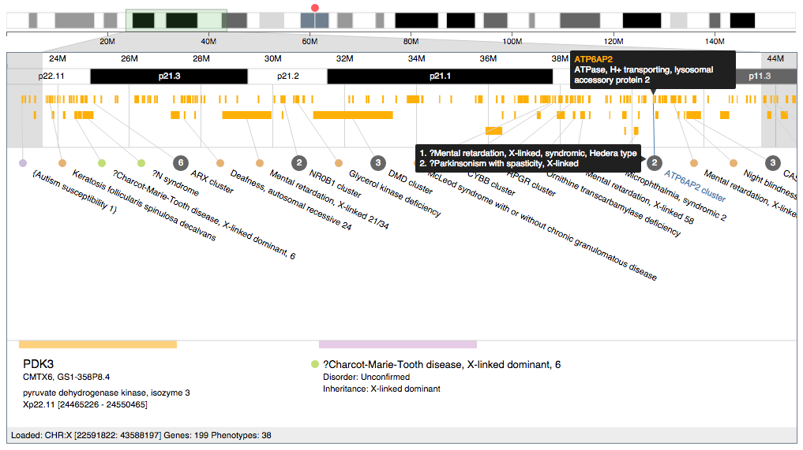

# angular-geneview-vis 

> An angular directive for interactive gene positional and phenotype representation



Live demo link: http://linjoey.github.io/angular-geneview-vis/

# Usage

Check the examples/ folder for code samples.

1. Install package dependencies with `./install.sh` or 
```
bower install
npm install
gulp 
```

2. Link CSS dependencies in HTML
```html
<link rel="stylesheet" href="bower_components/angular-chromosome-vis/angular-chromosome-vis.css" />
<link rel="stylesheet" href="src/angular-geneview-vis.css" />
<link rel="stylesheet" href="bower_components/angular-busy/dist/angular-busy.min.css" />
<link rel="stylesheet" href="bower_components/d3-context-menu/css/d3-context-menu.css"/>
```

3. Link JavaScript dependencies in HTML

```html
<script src="bower_components/angular/angular.min.js"></script>
<script src="bower_components/d3/d3.min.js"></script>
<script src="bower_components/underscore/underscore-min.js"></script>
<script src="bower_components/d3-context-menu/js/d3-context-menu.js"></script>

<script src="angular-chromosome-vis.js"></script>
<script src="bower_components/jsdas/jsdas.min.js"></script>
<script src="bower_components/angular-busy/dist/angular-busy.js"></script>

<script src="bower_components/d3-tip/index.js"></script>
<script src="../dist/angular-geneview-vis.min.js"></script>
```

4. Add `geneview`, `angularChromosomeVis`, and `cgBusy` as a dependency in your angular app. 


Start web server for development:
Directory must contain /soscip/api/ directory

```
php -S 127.0.0.1:9090 -t ./src/server/php
```

# Build

To build the project, run gulp in the root directory: `gulp dev` or `gulp release`. 

# Sample API calls

Get genes based on chromosome location

`http://localhost:9090/soscip/api/getgenes.php?chr=5&start=73640001&stop=77960000`

Get phenotypes from genes

`http://localhost:9090/soscip/api/gen2phen.php?gene=CCNB1`
